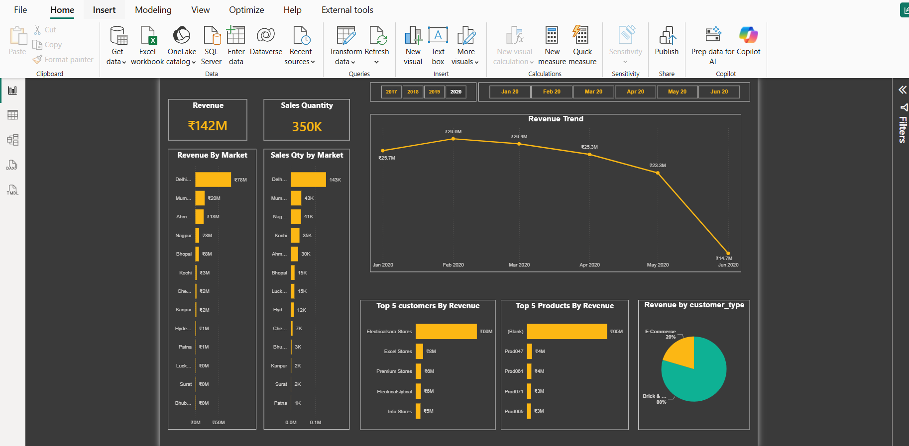
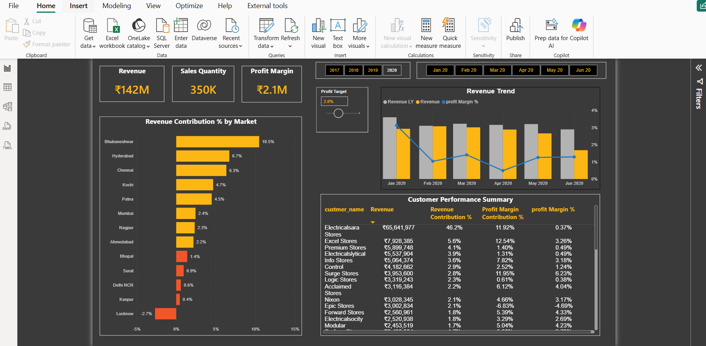
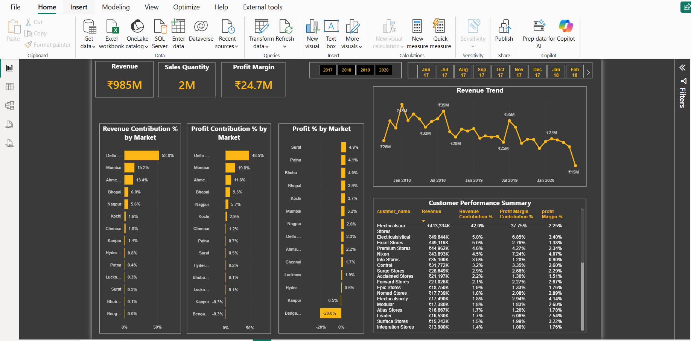

# AtliQ Hardware — Sales Insights & Profitability

> **A Power BI business analytics case study** using MySQL, Power Query, Power BI, and DAX to turn fragmented sales reporting into an interactive, profitability-focused decision-support dashboard.


> **Portfolio note:** This project is based on the publicly available AtliQ Hardware training dataset and uses a self-directed, simulated stakeholder-feedback process. It is not an actual client engagement.

---

## 📌 Project Snapshot

| Metric | Value |
|---|---:|
| **Analysis Period** | 2017–2020 |
| **Total Revenue** | **₹985M** |
| **Sales Quantity** | **~2M units** |
| **Total Profit** | **₹24.7M** |
| **Transactions** | **~150K** |

---

## 📑 Table of Contents

- [Overview](#-overview)
- [Business Problem](#-business-problem)
- [Business Questions](#-business-questions)
- [Dataset](#-dataset)
- [Tools & Technologies](#-tools--technologies)
- [Project Workflow](#-project-workflow)
- [Project Structure](#-project-structure)
- [Data Cleaning & ETL](#-data-cleaning--etl)
- [Data Modeling](#-data-modeling)
- [DAX & Analytical Measures](#-dax--analytical-measures)
- [Dashboard](#-dashboard)
- [Key Business Insights](#-key-business-insights)
- [Stakeholder Feedback & Iteration](#-stakeholder-feedback--iteration)
- [How to Run / Explore](#-how-to-run--explore)
- [Results & Conclusion](#-results--conclusion)
- [Limitations & Future Work](#-limitations--future-work)
- [Project Documentation](#-project-documentation)
- [Author & Contact](#-author--contact)

---

## 🔎 Overview

AtliQ Hardware is a computer hardware and peripherals distributor serving retail customers across India.

The original business scenario relied on verbal updates from Regional Managers and disconnected Excel files, making it difficult for the Sales Director to quickly understand revenue trends, market performance, customer concentration, and profitability.

This project builds an **end-to-end Power BI analytics solution**:

**MySQL → SQL Validation → Power Query ETL → Star Schema → DAX Measures → Power BI Dashboard → Stakeholder Feedback → Business Insights**

The focus is not only on building visuals, but on demonstrating how a Data Analyst translates a business reporting problem into a structured, decision-ready analytics product.

---

## 🎯 Business Problem

The Sales Director needed a more reliable and digestible way to understand business performance.

### Key challenges

- Regional updates were dependent on verbal reporting.
- Large Excel files made manual consolidation slow and difficult to consume.
- Revenue-only analysis could hide low-margin or loss-making markets.
- Customer concentration was difficult to evaluate.
- Market and channel performance needed a centralized, interactive view.
- Stakeholders needed a way to identify areas requiring further investigation.

### Desired Outcome

Build a centralized, self-service dashboard that provides a consistent view of:

- Revenue
- Sales quantity
- Profitability
- Market performance
- Customer performance
- Channel mix
- Time-based trends

---

## ❓ Business Questions

The dashboard was designed to answer:

1. How is revenue trending over time?
2. Which markets generate the most revenue?
3. Which markets generate the most profit?
4. Which customers contribute the most revenue?
5. Which customers have weak profit margins?
6. How does revenue differ between Brick-and-Mortar and E-Commerce?
7. Which markets are below a configurable profit target?
8. Is revenue concentration in a small number of customers creating business risk?

---

## 🗄️ Dataset

The project uses the **publicly available AtliQ Hardware training dataset**.

The source is modeled as a MySQL database containing approximately **150,000 sales transactions** across five core tables.

### Core tables

| Table | Role | Key Information |
|---|---|---|
| `sales_transactions` | Fact | Product, customer, market, order date, quantity, sales amount, currency |
| `customers` | Dimension | Customer name and customer type |
| `products` | Dimension | Product master |
| `markets` | Dimension | Market/city and zone |
| `date` | Dimension | Date, month-start date, year |

### SQL Exploration

MySQL Workbench was used before dashboard development to:

- Validate transaction volume
- Explore market-level records
- Validate yearly revenue
- Identify currency anomalies
- Investigate data-quality problems

Example:

```sql
-- Transaction volume
SELECT COUNT(*)
FROM sales_transactions;

-- Market-level inspection
SELECT *
FROM sales_transactions
WHERE market_code = 'Mark001';

-- Year-level revenue validation
SELECT
    SUM(sales_amount) AS total_revenue
FROM sales_transactions st
JOIN date d
    ON st.order_date = d.date
WHERE d.year = 2020;
```

SQL validation produced benchmark figures including approximately **₹142.22M revenue for 2020** and **₹336.02M for 2019**, which were later used to validate Power BI calculations.

---

## 🛠️ Tools & Technologies

| Category | Tools / Techniques |
|---|---|
| Database | MySQL, MySQL Workbench |
| SQL | SELECT, JOIN, GROUP BY, aggregation, filtering |
| ETL | Power Query / M |
| Data Modeling | Star Schema, 1-to-many relationships |
| BI | Power BI Desktop |
| Calculations | DAX |
| Deployment | Power BI Service |
| UX | Slicers, bookmarks, conditional formatting, comments, mobile layout |
| Project Method | AIMS Grid + stakeholder-feedback-driven iteration |
| Version Control | Git / GitHub |

---

## 🔄 Project Workflow

```text
Business Problem
      ↓
AIMS Grid Scoping
      ↓
Data Discovery
      ↓
SQL Exploration & Validation
      ↓
Power Query ETL / Data Cleaning
      ↓
Star Schema Data Model
      ↓
DAX Measures
      ↓
Dashboard Development
      ↓
Simulated Stakeholder Review
      ↓
Dashboard Iteration
      ↓
Business Insights & Recommendations
      ↓
Power BI Service Publishing
```

---

## 📁 Project Structure

A recommended repository structure is:

```text
AtliQ-Hardware-Sales-Insights/
│
├── README.md
│
├── dashboard/
│   └── AtliQ_Hardware_Sales_Insights.pbix
│
├── screenshots/
│   ├── key_insights.png
│   ├── Performance_Insights.png
│   └── Profit_Analysis.png
│
├── sql/
│   ├── exploratory_analysis.sql
│   └── validation_queries.sql
│
├── documentation/
│   └── AtliQ_Hardware_Sales_Insights_Project_Report.pdf
│
└── data/
    └── README.md
```

> Adjust the structure to match the actual files in the repository. Large datasets and sensitive credentials should not be committed to GitHub.

---

## 🧹 Data Cleaning & ETL

Data-quality issues identified during SQL exploration were handled in Power Query.

### Major issues addressed

| Data Issue | Action |
|---|---|
| Non-India markets with blank zones | Filtered out rows where zone was blank |
| Negative / zero sales amounts | Removed invalid transactions and flagged the source issue |
| Mixed INR and USD transactions | Created a normalized INR sales amount |
| `INR` vs `INR\r` and `USD` vs `USD\r` | Standardized currency labels and investigated duplicates |
| Normalized amount loaded as Text | Converted to Decimal Number |
| Blank product codes | Documented as a source-data limitation |

### ETL Pipeline

```text
MySQL Source
   ↓
Load five tables
   ↓
Filter irrelevant / invalid rows
   ↓
Clean currency labels
   ↓
Normalize USD → INR
   ↓
Correct data types
   ↓
Close & Apply
   ↓
Power BI Data Model
```

### Currency Normalization

A small number of transactions were stored in USD. The project used a fixed INR conversion approach as a deliberate simplification.

For a production implementation, an **effective-date exchange-rate table** would be preferable so historical transactions use the appropriate conversion rate for their transaction date.

---

## ⭐ Data Modeling

The model follows a **Star Schema** with one fact table and four dimension tables.

```text
                 ┌─────────────┐
                 │ Customers   │
                 └──────┬──────┘
                        │
┌─────────────┐   ┌─────▼────────────────┐   ┌─────────────┐
│ Products    │──►│ Sales Transactions    │◄──│ Markets     │
└─────────────┘   └─────▲────────────────┘   └─────────────┘
                        │
                 ┌──────┴──────┐
                 │ Date        │
                 └─────────────┘
```

### Relationships

| Dimension | Fact | Key | Cardinality | Filter |
|---|---|---|---|---|
| Customers | Sales Transactions | `customer_code` | 1 : many | Single |
| Products | Sales Transactions | `product_code` | 1 : many | Single |
| Markets | Sales Transactions | `market_code` | 1 : many | Single |
| Date | Sales Transactions | `date` ↔ `order_date` | 1 : many | Single |

This structure keeps the BI model easy to understand and supports efficient aggregation and filtering.

---

## 🧮 DAX & Analytical Measures

A dedicated **Base Measures** table was created to keep calculations organized and reusable across all dashboard pages.

### Core measures

| Measure | Purpose |
|---|---|
| **Revenue** | Total sales value using normalized sales amount |
| **Sales Quantity** | Total units sold |
| **Profit Margin** | Total transaction-level profit |
| **Profit Margin %** | Profit relative to revenue |
| **Revenue Contribution %** | Current market/customer revenue as a share of total revenue |
| **Profit Margin Contribution %** | Current market/customer profit as a share of total profit |

### Calculation approach

- `SUM()` for core aggregations
- `DIVIDE()` for safe ratios
- `ALL()` to calculate company-wide contribution baselines
- Filter context to keep metrics dynamic
- Dedicated measure organization for maintainability

---

# 📊 Dashboard

The final Power BI solution contains **three analytical views**.

## 1. Sales Overview

Focuses on high-level sales performance.

Includes:

- Revenue KPI
- Sales Quantity KPI
- Revenue by Market
- Sales Quantity by Market
- Revenue Trend
- Top 5 Customers
- Top 5 Products
- Brick-and-Mortar vs. E-Commerce
- Year and Month slicers



---

## 2. Profitability & Customer Performance

This view moves beyond revenue-only reporting and focuses on profitability.

Includes:

- Revenue Contribution % by Market
- Profit Contribution % by Market
- Profit Margin % by Market
- Revenue Trend
- Customer Performance Summary



---

## 3. Consolidated Performance

This view combines performance tracking with exception monitoring.

Includes:

- Revenue Contribution % by Market
- Configurable Profit Target
- Current Revenue vs. Prior-Year Revenue
- Profit Margin %
- Customer Performance Summary
- Conditional formatting for under-target markets



---

## 💡 Key Business Insights

### 1. Revenue and Profitability Are Not Aligned

**Delhi NCR contributes approximately 52.8% of total revenue but only 48.5% of total profit contribution**, with a relatively modest **2.3% profit margin**.

This shows why revenue alone is insufficient for evaluating market performance.

### 2. Mumbai Shows Stronger Relative Profitability

Mumbai contributes around **15.2% of revenue** while its share of total profit is disproportionately stronger relative to its revenue contribution.

This makes Mumbai an interesting benchmark for further investigation into pricing, discounting, and product mix.

### 3. Bengaluru Shows a Negative Profit Margin

Bengaluru records approximately **−20.8% profit margin** on a very small revenue share.

This should trigger further investigation rather than an immediate conclusion about root cause.

### 4. High Customer Concentration

**Electricalsara Stores accounts for roughly 42–46% of revenue depending on the period analyzed**, creating significant customer-concentration risk.

The account is an important revenue driver, but dependency should be monitored.

### 5. Revenue Has Declined Over Time

The historical trend across **2017–2020** shows revenue declining from the earlier peak toward 2020.

The dashboard identifies the pattern while leaving the underlying causes for further investigation.

### 6. Channel Mix

For the 2020 view, the business is approximately:

- **80% Brick-and-Mortar**
- **20% E-Commerce**

This provides a baseline for monitoring future channel diversification.

---

## 🔄 Stakeholder Feedback & Iteration

A **simulated stakeholder review** was used to demonstrate how a BI product can evolve after its first working version.

Examples:

| Feedback | Change |
|---|---|
| Revenue used raw sales amount | Repointed Revenue to normalized sales amount |
| Profitability was not visible | Added profit and margin analytics |
| Revenue did not show market quality | Added contribution measures |
| Customer profitability needed a combined view | Added Customer Performance Summary |
| Channel mix was unclear | Added customer-type split |
| Underperforming markets needed attention | Added Profit Target and conditional formatting |
| Order counts were requested | Logged as a source-data limitation |
| More historical data was requested | Logged as a data-availability limitation |
| Write-back/comments were requested | Assessed as a future Power Platform enhancement |

This demonstrates **requirements-driven iteration**, rather than treating a dashboard as a one-time deliverable.

---

## 🚀 How to Run / Explore

### Option 1 — Explore the Dashboard

1. Clone the repository:

```bash
git clone <YOUR_GITHUB_REPOSITORY_URL>
cd AtliQ-Hardware-Sales-Insights
```

2. Open the Power BI `.pbix` file from the `dashboard/` directory.

3. Review the three report pages:
   - Sales Overview
   - Profitability & Customer Performance
   - Consolidated Performance

4. Use the year/month slicers, cross-filtering, customer matrix, and Profit Target control to explore the model.

### Option 2 — Reproduce the Data Preparation

If the repository contains the source SQL/database files:

1. Restore/import the provided dataset into MySQL.
2. Open the Power BI file.
3. Update the MySQL connection details if required.
4. Refresh the Power Query transformations.
5. Validate the model relationships.
6. Refresh the DAX-based visuals.

> The exact connection steps depend on how the repository's database files are packaged. Do not commit passwords or private connection details.

---

## ✅ Results & Conclusion

This project demonstrates an end-to-end **Data Analyst / BI Analyst workflow** from an operational database to a decision-ready reporting product.

### What was delivered

- SQL-based data exploration and validation
- Power Query ETL and data-quality remediation
- Star-schema data model
- Reusable DAX measure layer
- Three-page Power BI dashboard
- Profitability analysis
- Customer concentration analysis
- Interactive exception monitoring
- Power BI Service publishing
- Mobile-ready dashboard layout
- Stakeholder-feedback-driven iteration

### Business value of the solution

The dashboard is designed to:

- Reduce dependence on manual Excel consolidation
- Improve visibility into market and customer performance
- Expose profitability patterns hidden by revenue-only reporting
- Make underperforming markets easier to identify
- Support more focused business investigation and decision-making

---

## ⚠️ Limitations & Assumptions

- Historical source data covers approximately **2017–2020**.
- No distinct order identifier is available, so order-level metrics are limited.
- Some data-quality issues were present in the source system.
- USD conversion uses a simplified fixed-rate assumption.
- The dashboard uses **scheduled refresh**, not real-time streaming.
- Stakeholder feedback was simulated for portfolio-learning purposes.
- AIMS success criteria were project targets and were not independently measured.
- Business impact described here is expected/potential impact rather than measured post-deployment ROI.

---

## 🔮 Future Work

Potential future improvements include:

1. Introduce a dedicated analytical data warehouse for larger-scale production use.
2. Replace fixed currency conversion with an effective-date exchange-rate dimension.
3. Capture distinct order IDs to support order-level and fulfillment analysis.
4. Extend historical data retention beyond 2017–2020.
5. Add write-back capability using Power Apps / Microsoft Power Platform.
6. Expand profitability analysis to deeper product, customer, and regional root-cause analysis.

---

## 📄 Project Documentation

A detailed project report is included in the repository covering:

- Business Problem
- AIMS Grid
- Data Discovery & SQL Analysis
- Data Cleaning & ETL
- Star Schema Modeling
- DAX Measures
- Dashboard Development
- Stakeholder Feedback
- Business Insights
- Publishing & Deployment
- Limitations
- Recommendations

**Project Report:**  
`documentation/AtliQ_Hardware_Sales_Insights_Project_Report.pdf`

---

## 🔗 Project Links

**GitHub Repository:**  
`<YOUR_GITHUB_REPOSITORY_URL>`

**Live Power BI Report:**  
https://app.powerbi.com/groups/me/reports/70265cf2-d9f4-40a3-94f6-d4222fdf3f48/1123c8c68e757c8c94ee?experience=power-bi

**LinkedIn:**  
https://www.linkedin.com/in/sahajahanur-laskar/

---

## 👤 Author & Contact

### Sahajahanur Rahman Laskar (Sahajan)

**Data Analyst | SQL | Power BI | Excel | Python**

📧 Email: connectingsrl@gmail.com  
🔗 LinkedIn: https://www.linkedin.com/in/sahajahanur-laskar/  
💻 GitHub: https://github.com/Sahajahanur

---

## ⭐ Final Takeaway

This project is designed to demonstrate that effective analytics is not just about creating charts.

It is about:

**Understanding the business problem → validating the data → cleaning and modeling the data → building meaningful metrics → developing an interactive dashboard → responding to stakeholder feedback → translating findings into business actions.**

